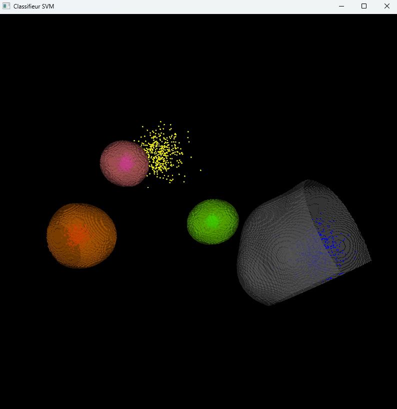

# Decid3D

# **Introduction to Machine Learning using Opencv and VTK for 3D visualisation**  

Install Visual studio 2022 redistribuable   
Run Decid_3D_2025_mod.exe  
Load csv file  
Train and Test SVM, Multilayer perceptron (neural network), Knn, Random Forest, Boosting, EM (non supervised) etc   
2D and 3D visualisation of data and classification boudary are available (data 2 features or 3 features)  
For more features, only a 2D projection of data is available.  
Application : classifiers : for image acquisition/segmentation, the first webcam is used.  

This software is for teaching and testing purpose only. 
Used in Universite Bourgogne Europe  
Master Traitement du Signal et des Images  

CSV format : one sample = one line  
class number, feature 1, feature 2  
class number, feature 1, feature 2 

Example 5 samples, 3 classes, in 2D

0,0.35,0.4  
0,0.15,0.2  
1,0.25,0.2  
1,0.15,0.6  
2,0.18,0.16  

# Example of Neural Network bundaries

